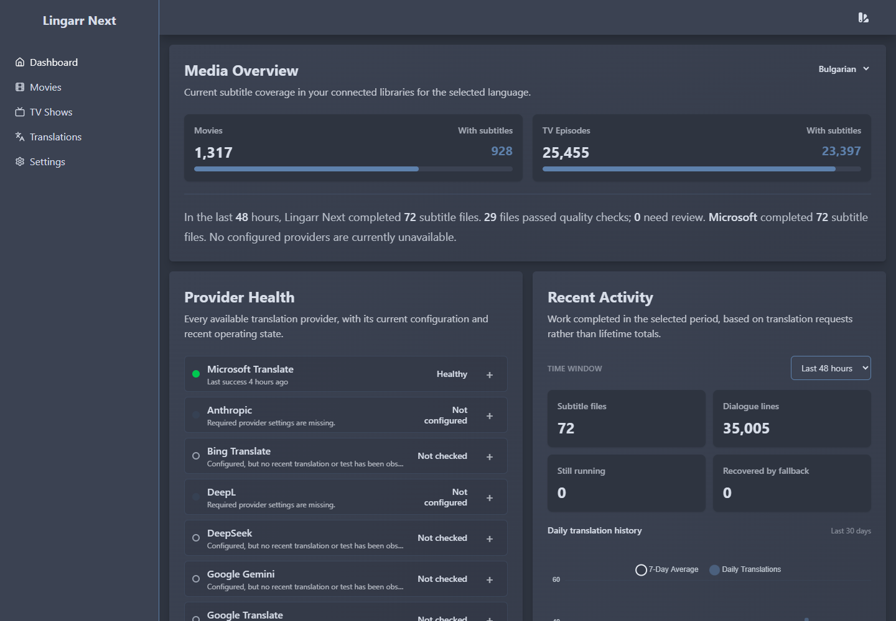
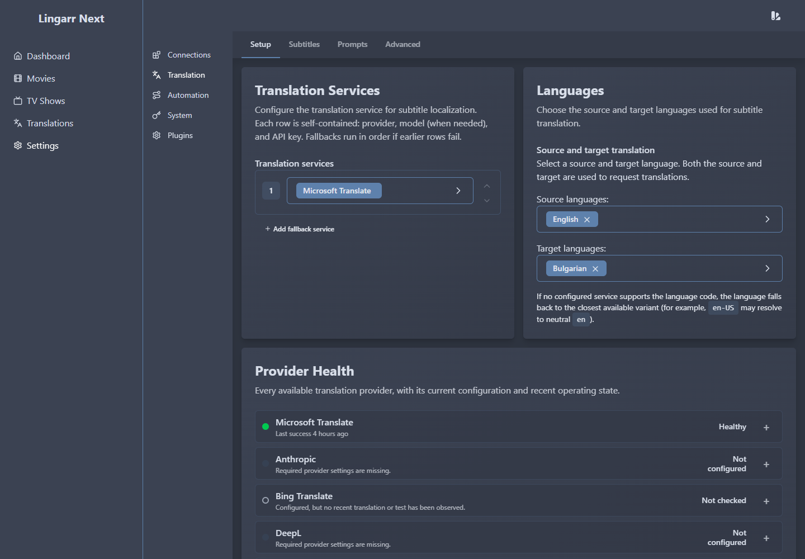

# Lingarr Next

[](https://github.com/apoapostolov/lingarr/releases)
[](https://github.com/apoapostolov/lingarr/pkgs/container/lingarr)
[](https://github.com/apoapostolov/lingarr/actions/workflows/ci.yml)
[](https://dotnet.microsoft.com/)
[](LICENSE)
[](https://github.com/apoapostolov/lingarr)

Lingarr Next is a self-hosted subtitle translation manager for movie and TV
libraries. It discovers subtitles through Sonarr and Radarr, translates them
with local, free, or paid providers, and makes the result understandable through
provider health, subtitle quality scores, fallback reporting, and recent-work
statistics.

<p align="center">
  
</p>

> **About this fork:** Lingarr Next is a separate fork of
> [Lingarr](https://github.com/lingarr-translate/lingarr), maintained by
> **Apostol Apostolov**. It exists to speed up development independently from
> upstream's strict no-AI development rules. AI-assisted development is welcome
> here, but every change remains subject to human review, testing, and maintainer
> accountability.

> **Self-hosted:** This repository does not provide a public translation
> service. You run Lingarr Next and connect your own media libraries and
> translation providers.

## What's new in 1.0.0

Version 1.0.0 establishes the independent Lingarr Next release line. It
combines the Bedroom work to date into one supported baseline:

- A redesigned Dashboard explains subtitle coverage, provider health, recent
  progress, quality results, fallbacks, and metered LLM usage.
- Translation services can be arranged as an ordered provider-and-model
  fallback chain.
- OpenRouter, Z.ai Coding Plan, OpenCode Go, and improved DeepSeek support join
  the existing translation providers.
- Every completed subtitle receives an observe-only quality score with
  inspectable findings.
- System and Context prompts are now reusable, versioned instruction profiles
  that can be assigned to individual AI translators.
- Settings are organized into clear local tabs, anonymous telemetry is removed,
  and update checks point to this fork.
- Subtitle scanning, scheduled automation, Microsoft translation, and Hangfire
  SQLite maintenance are substantially more resilient.

Read the complete [1.0.0 changelog](CHANGELOG.md).

## Features

### Operational Dashboard

- **Language coverage** shows the share of movies and TV episodes that already
  have subtitles in your chosen primary language. The selection is remembered.
- **Provider Health** lists every translator as Healthy, Not checked, Needs
  attention, Recently unavailable, Unavailable, or Not configured, with
  expandable diagnostics and safe provider tests.
- **Recent Activity** retains the readable historical graph while adding
  completed-file counts, quality results, active work, fallback recoveries, and
  a configurable time window.
- **Human-readable progress** summarizes completed subtitle files and the
  provider responsible for them without exposing subtitle text.
- **Metered LLM usage** reports input tokens, output tokens, and an approximate
  cost when OpenRouter, OpenAI, DeepSeek, or Anthropic handled translations.

### Translation workflow and quality

- Automatic discovery and translation for connected Sonarr and Radarr
  libraries.
- Manual and API-triggered subtitle translation with optional explicit subtitle
  paths.
- Ordered provider fallbacks keep work moving when an earlier translator fails.
- Completed subtitles receive a deterministic score from 0 to 100.
- Quality findings detect suspicious output, damaged markup, missing content,
  script mismatches, poor readability, and other translation risks.
- Quality is currently **observe-only**: it helps you review translations but
  does not silently reject or delete a completed file.
- The Translations list shows source, target, status, quality, progress, episode
  details, and compact relative completion times.

### Translation providers

| Category | Providers |
| --- | --- |
| Free / web translators | Microsoft Translate, Google Translate, Bing Translate, Yandex Translate |
| Hosted translation APIs | DeepL, LibreTranslate |
| AI providers | OpenRouter, OpenAI, Anthropic, DeepSeek, Google Gemini, Qwen General AI, Qwen Translation, Z.ai Coding Plan, OpenCode Go, xAI API, xAI SuperGrok / Premium+ |
| Self-hosted AI | LocalAI, Ollama, and compatible OpenAI-style endpoints |

AI services expose model selectors where supported. A translation chain may use
the same provider more than once with different models. OpenRouter keeps
`openrouter/free` first as the Lingarr Next default for inexpensive bulk work, with
`openrouter/auto` second and the remaining catalogue after it.

Qwen is offered in two forms: general Qwen models support Lingarr instruction
profiles, while Qwen Translation uses Qwen-MT's purpose-built language controls.
xAI is likewise offered as the conventional developer API and as an experimental
device-login connection for SuperGrok / Premium+ accounts.

### Instruction profiles

- Separate **System Prompt** and **Context Prompt** libraries.
- Create, rename, duplicate, version, activate, and delete profiles.
- Assign profiles to individual AI provider rows or inherit the active default.
- Built-in examples include translation role, tone, profanity, names, glossary,
  captions, readability, ambiguity, and final-output rules.
- Existing prompt placeholders remain available, including source/target
  language and dialogue-context tags.

### Settings and operator experience

- Settings are grouped into **Connections**, **Translation**, **Automation**,
  **System**, and **Plugins**.
- Translation has local **Setup**, **Subtitles**, **Prompts**, and **Advanced**
  tabs.
- Translation Services are placed before Languages and retain the familiar
  Lingarr Next card and field vocabulary.
- Save notifications use a visible theme-aligned toast with restrained spring
  motion and rate limiting.
- Anonymous telemetry and its onboarding step are completely removed.
- Update checks use the Apostol Apostolov fork rather than the upstream
  repository.

<p align="center">
  
</p>

### Reliability

- Subtitle discovery avoids unbounded recursive scans, ignores trailer folders,
  and still finds conventional subtitle directories.
- Scheduled automation pages through large libraries and retains a durable
  cursor instead of repeatedly starting from the beginning.
- Hangfire SQLite receives startup recovery and periodic WAL checkpoint
  maintenance.
- Microsoft/GTranslate requests use longer provider-specific timeouts and
  transient retry with jitter.
- Invalid Sonarr/Radarr identifiers are rejected early and routine skip messages
  no longer dominate logs.
- API keys remain encrypted settings; provider-health and usage records never
  store subtitle text, prompts, credentials, or media paths.

## Quick start with Docker Compose

The simplest installation uses SQLite and the published multi-architecture
container:

```yaml
services:
  lingarr:
    image: ghcr.io/apoapostolov/lingarr:latest
    container_name: lingarr
    restart: unless-stopped
    ports:
      - "9876:9876"
    environment:
      ASPNETCORE_URLS: http://+:9876
      DB_CONNECTION: sqlite
      SERVICE_TYPE: microsoft
      MAX_CONCURRENT_JOBS: 1
    volumes:
      - ./config:/app/config
      - /path/to/media/movies:/movies
      - /path/to/media/tv:/tv
```

Start the service:

```bash
docker compose up -d
```

Open `http://localhost:9876`, connect Sonarr and/or Radarr under
**Settings → Connections**, configure paths, then choose translation providers
under **Settings → Translation → Setup**.

MySQL and PostgreSQL remain supported for larger or existing installations.
Docker secrets can be supplied by using the `_FILE` form of supported
environment variables.

## Updating and migration

Lingarr Next begins its own version line at **1.0.0**. That number is
independent from upstream Lingarr versions and should not be compared
numerically with an upstream `1.x` tag.

Before changing from upstream Lingarr or an older fork build:

1. Back up `/app/config` and your application database.
2. Review [CHANGELOG.md](CHANGELOG.md), especially migrations and provider
   configuration.
3. Change the image to `ghcr.io/apoapostolov/lingarr:latest`.
4. Start the container and allow the automatic database migrations to finish.
5. Confirm the translation chain, paths, prompt profiles, and provider health
   before starting a large automated run.

Legacy plain-string and string-array `SERVICE_TYPE` values remain accepted and
are normalized into the richer provider/model chain format.

## Configuration

Common environment variables:

| Variable | Purpose |
| --- | --- |
| `ASPNETCORE_URLS` | Internal listen URL; normally `http://+:9876` |
| `DB_CONNECTION` | `sqlite`, `mysql`, or `postgresql` |
| `SQLITE_DB_PATH` | Optional application SQLite path |
| `DB_HANGFIRE_SQLITE_PATH` | Optional Hangfire SQLite path |
| `MAX_CONCURRENT_JOBS` | Number of translation workers |
| `SERVICE_TYPE` | One provider or an ordered JSON provider/model chain |
| `SOURCE_LANGUAGES` | Minified JSON list of allowed source languages |
| `TARGET_LANGUAGES` | Minified JSON list of target languages |
| `RADARR_URL` / `RADARR_API_KEY` | Radarr connection |
| `SONARR_URL` / `SONARR_API_KEY` | Sonarr connection |
| `AUTH_ENABLED` | Enable Lingarr Next authentication |
| `BASE_PATH` | Optional reverse-proxy path prefix |

See [Settings.MD](Settings.MD) for the full environment-variable reference.

## Documentation

- [Documentation index](docs/README.md)
- [Architecture and request flows](docs/architecture.md)
- [Testing and live smoke checks](docs/testing.md)
- [AI providers, model selection, and fallback chains](docs/ai-providers-model-fallback-chain.md)
- [Provider health, subtitle quality, Dashboard, and instruction profiles](docs/proposals/translation-confidence-and-instruction-profiles.md)
- [Settings information architecture](docs/proposals/settings-page-ia-and-qol.md)
- [Current AI-assisted development plan](DEVELOPMENT_PLAN.md)
- [API documentation sources](Lingarr.Docs/)

## Development and contributing

Contributions, bug reports, and carefully reviewed AI-assisted work are welcome.
Contributors must understand and be able to explain submitted changes; low-effort
generated output is not accepted merely because AI use is allowed.

Start with [CONTRIBUTING.md](CONTRIBUTING.md), [AGENTS.md](AGENTS.md), and the
[testing guide](docs/testing.md).

## Upstream and credits

Lingarr Next is built on the work of the
[Lingarr project](https://github.com/lingarr-translate/lingarr) and its
contributors. Upstream remains a source for selective, reviewed imports; this
fork has its own roadmap, releases, container images, update checks, and support
expectations.

Additional project credits:

- Icons: [Lucide](https://lucide.dev/icons)
- Subtitle parsing: [SubtitlesParser](https://github.com/AlexPoint/SubtitlesParser)
- Translation support: LibreTranslate, GTranslate, and the provider projects
  listed above

## License

GNU Affero General Public License v3.0. See [LICENSE](LICENSE).
